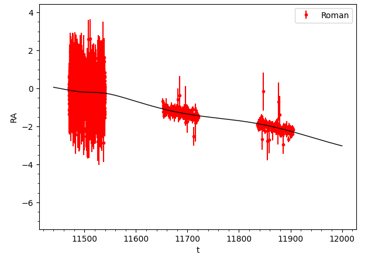
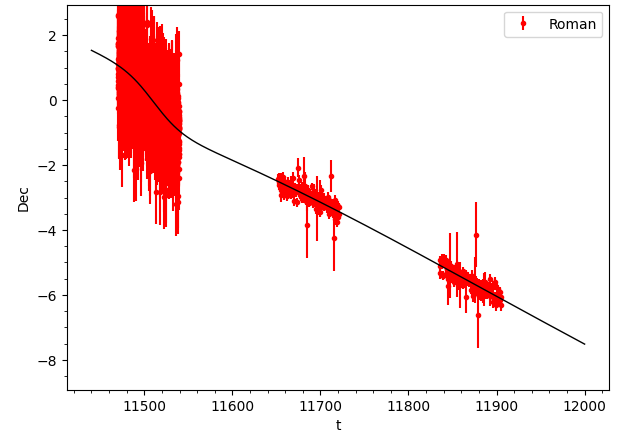

[Back to **Astrophotometric fits**](Astrophotometric.md)

# Astrometric Plots

The subpackage `RTModel.plotmodel` contains functions for plotting the astrometric centroid trajectory and comparing with the observations.

Assuming you have a completed run on some astrophotometric event in its directory `/astroevent001`, we proceed as for purely photometric events to [plot the light curve](PlotModel.ms) as usual

```
import RTModel.plotmodel as plm
import glob

event = '/astroevent001'
models = glob.glob(event +'/FinalModels/*')
model = models[0] # let's plot the first of the best models

myplot = plm.plotmodel(eventname = event, modelfile = model)
```

The output will look like this


We note that the parameters table contains the assessment for the four additional astrometric parameters `muS_Dec, muS_RA, piS, thetaE`, as explained [before](Astrophotometric.md).

## Centroid trajectory in the sky

Now, to see the trajectory of the centroid in the sky, we just type

```
myplot.showastrometry()
```


Only the first astrometric series found is displayed, since the centroid trajectory also depends on the blending fraction, which varies for each telescope/filter. If we want to show a specific astrometric series, we just have to add the number of the telescope in the order it appears in the legend of the light curve, starting from zero: `myplot.showastrometry(1)`.

In the example shown above, we note that the error bars are much larger than the astrometric displacement, having assumed an uncertainty of 1 milliarcsecond in our simulation. Astrometric data in the years following the microlensing peak are very precious to fix the proper motion and the source parallax.

## RA and Dec timeseries

In alternative, we may show the Right Ascension or Declination as functions of time with the following functions.
```
myplot.showastrometryRA()
```



```
myplot.showastrometryDec()
```



They both accept the telescope number as optional argument.

[Go to **High-Resolution Imaging**](HighResolutionImaging.md)
