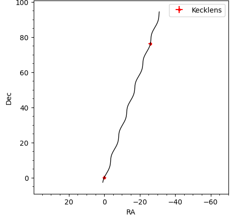

[Back to **Astrometric Plots**](AstrometricPlots.md)

# High-Resolution Imaging

High-Resolution observations from space or from ground telescopes with adaptive optics are able to resolve the lens and the source as separate objects after a few years from the microlensing event. In this case, we have separate information about the source position and the lens position at two epochs at least. 

## Data preparation

`RTModel` is able to take the information coming from high-resolution imaging into account in the modeling of a microlensing event. In order to do that, we have to include two special datasets in the `/Data` directory: one for the lens and one for the source. In the minimal situation in which we just have one observation a few years after the microlensing event, such datasets will look as follows:

`HRsource.dat`

```
# Mag err HJD Dec errDec RA errRA
23.0 -1.0 11510.86 0 1.0 0 1.0
23.0 -1.0 13520.0 0 1.0 0 1.0
```

`HRlens.dat`

```
# Mag err HJD Dec errDec RA errRA
23.0 -2.0 11510.86 0 1.0 0 1.0
23.0 -2.0 13520.0 76.15 1.0 -25.95 1.0
```

Both datasets are just made up of two data points: one at the time of the peak and one at the High-Resolution observation epoch. 

Note that both datasets come with a negative uncertainty for the photometric magnitude. In this way `RTModel` ignores the photometric information and only uses the astrometry. A value '-1' in the uncertainty is used to identify the source dataset, while the uncertainty '-2' identifies the lens dataset.

In the source dataset, both epochs report '0' for the astrometric coordinates RA and Dec. This means that we are choosing a reference frame comoving with the source. This is natural if our high-resolution observations only provide relative astrometry for the lens-source system. In this case, the lens dataset will have the first epoch at the microlensing peak in the same coordinates of the source, whereas the second epoch will report the relative astrometric shift from the source in Dec and RA.

In principle, `RTModel` is perfectly able to deal also with the case in which the source and the lens positions are measured with respect to an absolute reference frame. In this case, at the second epoch both will have some non-zero astrometric shift from the original position.

## Modeling and results

The modeling process flows identically to the case of [astrophotometric datasets](Astrophotometric.md). In the directory `/events`, the file [HRevent.zip`](/event/HRevent.zip) contains an example with simulated High-Resolutions observations.

In the end, the astrometric plot for the lens will look like this

```
myplot.showastrometry()
```



The lens centroid (calculated ignoring the source) interpolates the two data points.

With only two observations, the source parallax remains unconstrained and this causes infinite uncertainty on all astrometric parameters:


```
├─────────┼─────────────────────┤
│ muS_Dec │ -0 +- 98981         │
├─────────┼─────────────────────┤
│ muS_RA  │ 0 +- 1898988        │
├─────────┼─────────────────────┤
│ piS     │ 0 +- 5725837        │
├─────────┼─────────────────────┤
│ thetaE  │ 2 +- 116            │
╘═════════╧═════════════════════╛
```

However, we have imposed that the reference frame follows the source, so that the proper motion should be zero by construction. if we repeat the fit by imposing the source proper motion to be zero, we retrieve accurate information for the remaining parameters. In order to do that, before the modeling run we have to impose the following [constraint](Constraints.md)
```
rtm.set_constraints([['muSDec',0,-.001,.001],['muSRA',0,-.001,.001]])
```

In this way, the reported uncertainties will be realistic

```
├─────────┼─────────────────────┤
│ muS_Dec │ 0.00000 +- 0.00100  │
├─────────┼─────────────────────┤
│ muS_RA  │ 0.00000 +- 0.00100  │
├─────────┼─────────────────────┤
│ piS     │ 0.05 +- 0.77        │
├─────────┼─────────────────────┤
│ thetaE  │ 1.57 +- 0.11        │
╘═════════╧═════════════════════╛
```


[Go to **Animaton of the Fit process**](Animation.md)
