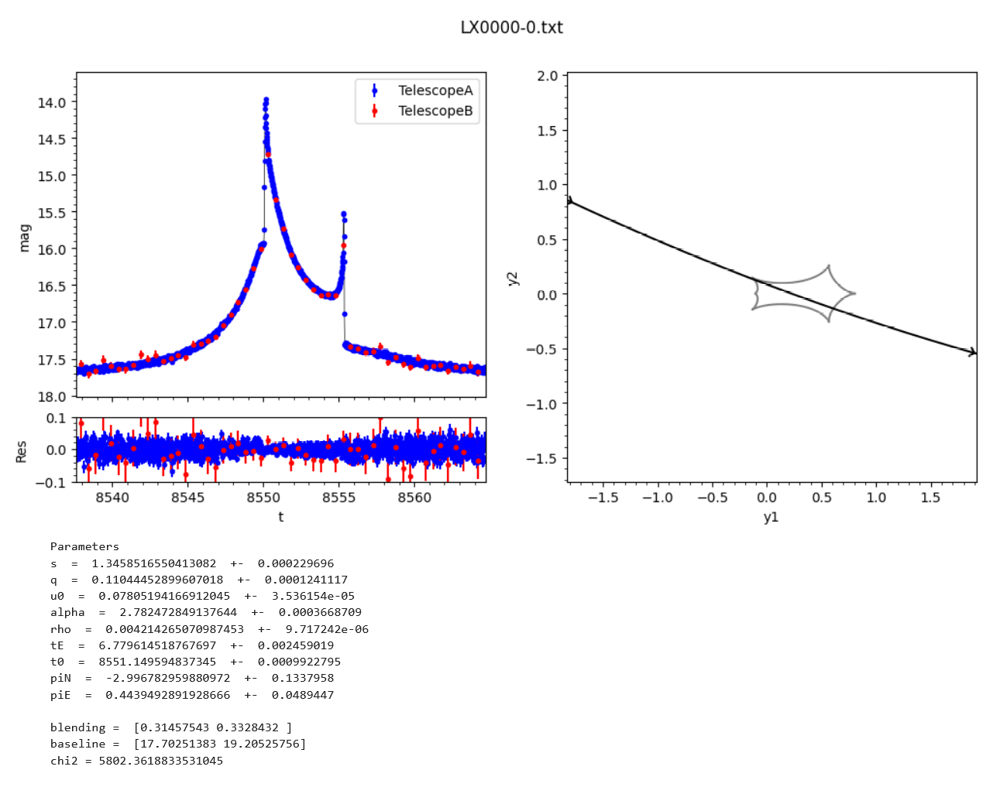

[Back to **Model categories**](ModelCategories.md)

# Plotting models

`RTModel` comes with a subpackage that is intended for fast and basic visualization of results with a minimal number of options.

Assuming you have a completed run on some event in its directory `/event001`, we may plot the best models with the following code

```
import plotmodel as plm
import glob

event = '/event001'
models = glob.glob(event +'/SelectedModels/*')
model = models[0] # let's plot the first of the best models

pm = plm.plotmodel(eventname = event, modelfile = model)
```




[Go to **Archiving and updating models**](Archive.md)
