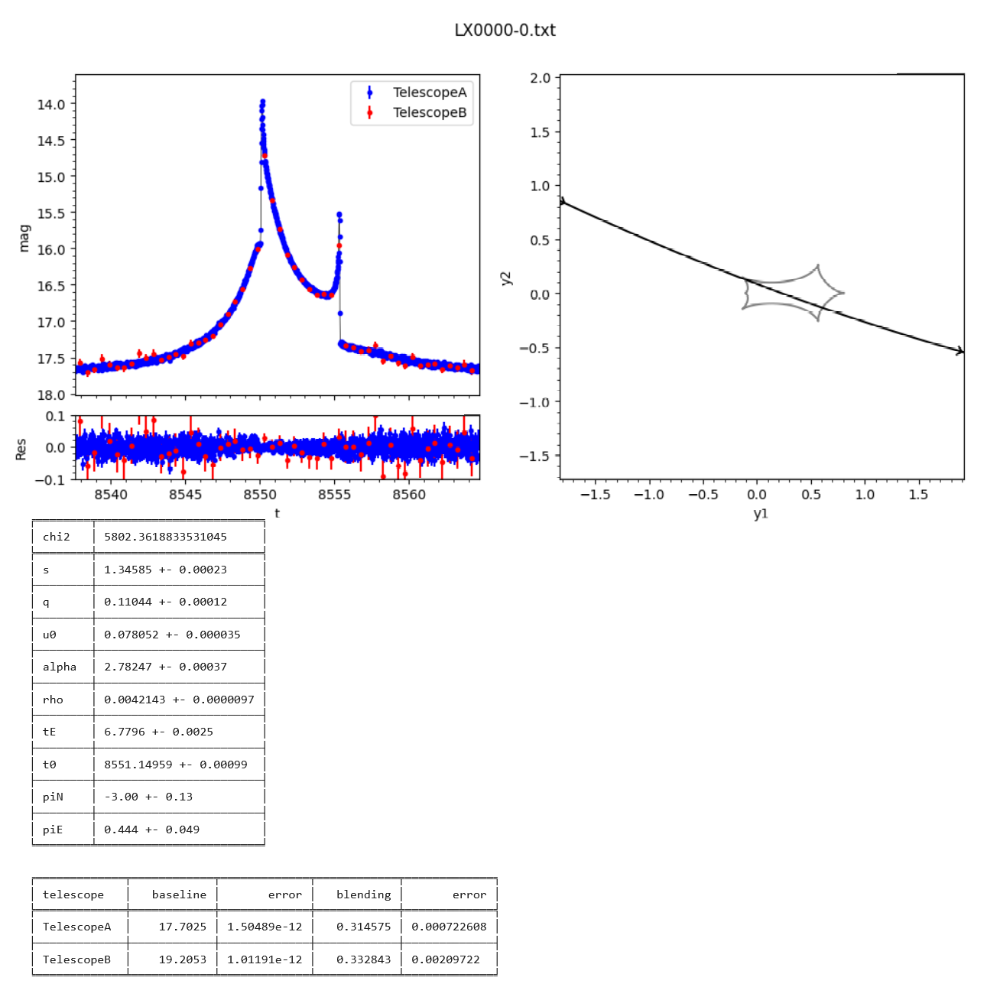

[Back to **Model categories**](ModelCategories.md)

# Plotting models

`RTModel` comes with a subpackage that is intended for fast and basic visualization of results with a minimal number of options.

Assuming you have a completed run on some event in its directory `/event001`, we may plot the best models with the following code

```
import RTModel.plotmodel as plm
import glob

event = '/event001'
models = glob.glob(event +'/FinalModels/*')
model = models[0] # let's plot the first of the best models

myplot = plm.plotmodel(eventname = event, modelfile = model)
```

The output will look like this



On the left, we have the model light curve with the data points. Residuals are also shown below. the source trajectory and the caustics are shown on the right. The plots are followed by the list of parameters with their errors. For each telescope we also have the blending fraction $F_{background}/F_{source}$ and the baseline magnitude. Finally, the chi square for the model is displayed.

## Options

Here is a list of arguments available for the `plotmodel` function:
- `eventname`: Directory of the event prepared according to the indications in [Data preparation](DataPreparation.md)
- `modelfile = None`: The file name containing the model we want to plot. The type of model is identified by the first two characters in the filename. For example, 'LX0000-0.txt' is a file containing a binary lens with parallax (see [Model categories](ModelCategories.md)). The parameters are read from the file. If `modelfile` is not specified, you may plot any kind of models specifying your parameters in input by providing the arguments `model` and `parameters`.
- `model = None`: If modelfile is left blank, you may specify here the model you want to plot following the labels given in [Model categories](ModelCategories.md). Example: `model = 'LS'`. The parameters of the model should be given through the argument `parameters`
- `parameters = []`: parameters of a user-defined model. The order and meaning of the parameters depends on the model chosen through the argument `model` (see [Model categories](ModelCategories.md)).
- `tmin = None`, `tmax = None`: Minimum and maximum time for the plot in units of HJD-2450000. If not specified, the plot is made between t0-2tE and t0+2tE.
- `timesteps = 300`: Number of steps in time axis.
- `magmin = None`, `magmax = None`: Minimum and maximum magnitude in the light curve plot. If not specified, these are deduced from the light curve model.
- `tlabel = 't'`, `maglabel = 'mag'`, `reslabel = 'Res'`: Labels for the axes in the light curve plot.
- `referencephot = 0`: Dataset to be used as photometric reference for the magnitude axis. All other datasets are rescaled to magnitudes in the system of the chosen dataset. By default the first dataset is chosen.
- `printpars = True`: If left True, the parameters are printed below the figure, otherwise only the figure is shown.
- `accuracy = 0.01`: The accuracy of magnification calculations in the plot.

## Properties of the ```plotmodel``` object

Further customization of the plots is possible by manipulation of the object returned by the `plotmodel` function as shown in the following example:

```
myplot.causticcolor = 'g'
myplot.telescopes = ['Everest', 'Aconcagua']
myplot.showall()
```

Here we have changed the color of the caustic to green and changed the displayed names of the two telescopes in the legend. To see the plot with these changes, you may call the `showall()` function. Some changes require to recalculate the model and you should precede the `showall()` with a call to `calculate()`:

```
myplot.tmin = 9300
myplot.calculate()
myplot.showall()
```

Here is a list of properties of a `plotmodel` object that are available for customization:
- `telescopes`: List of telescope names to be shown in the legend. By default, the names of the data files are used.
- `legendlocation`: Location of the legend according to the options available in matplotlib.
- `colors`: List of colors of the datasets.
- `satellitecolors`: List of colors of the light curve model as seen by ground telescopes (the first entry) and the light curves as seen by the satellites. The corresponding source tracks in the right plot take the same colors.
- `sourcecolor`: Color of the source disk in the plot showing the source trajectory and the caustic.
- `causticcolor`: Color of the caustic.

Finally, all optional parameters in the call of the `plotmodel` can be also manipulated as in the case of `tmin` shown above.

## Retrieving and saving the figures

It is possible to generate separate plots for the light curve and for the caustic with the source trajectory using the following functions

```
myplot.showlightcurve()
myplot.showcaustics()
```

Finally, each plot can be saved to a file. In fact, after the execution of `showlightcurve()`, `showcaustics()`, `showall()` or the constructor of `plotmodel`, the property `figure` contains the figure just created. Therefore, you can save it with the line

```
myplot.figure.savefig('myfile.png')
```

## Orbital elements

The fit parameters for [models with orbital motion](ModelCategories.md) may not be as transparent. The subpackage `plotmodel` offers the function `orbital_elements` for a translation to conventional orbital elements. Suppose you have obtained a model with circular orbital motion `LO0001-1.txt'. If we just use `plotmodel` as before, we can read the fitting parameters, including the three components of the orbital velocity. However, if we write

```
import RTModel.plotmodel as plm
orbitalelements = plm.orbital_elements(`LO0001-1.txt')
for oe in orbitalelements:
    print(oe,' = ',orbitalelements[oe])
```

the output will be the list of conventional orbital elements calculated from the components of the orbital motion

```
T  =  3362.6154510332913
a  =  0.5269665151055616
e  =  0
inc  =  1.3715375471903625
OM  =  0.35
om  =  0
phi0  =  0.45222968275074405
epoch  =  9816.2023437747
```

The elements are as follows
- T: orbital period in days
- a: semimajor axis in Einstein radii
- e: eccentricity (0 for circular orbital motion)
- inc: inclination in radians (0 is face-on, 1.57 is edge-on)
- OM: longitude of the ascending node in radians, taken from the binary axis at time t0.
- om: argument of periastron in radians (0 for circular orbital motion)
- phi0: true anomaly in radians (taken from the ascending node for circular orbital motion)
- epoch: epoch of the periastron in HJD (for circular orbital motion this coincides with the epoch of the ascending node)

The same function can also be used for models obtained with [eccentric orbital motion](ModelCategories.md), for which the eccentricity and the argument of the periastron will take non-zero values. 

[Go to **Archiving and updating models**](Archive.md)
