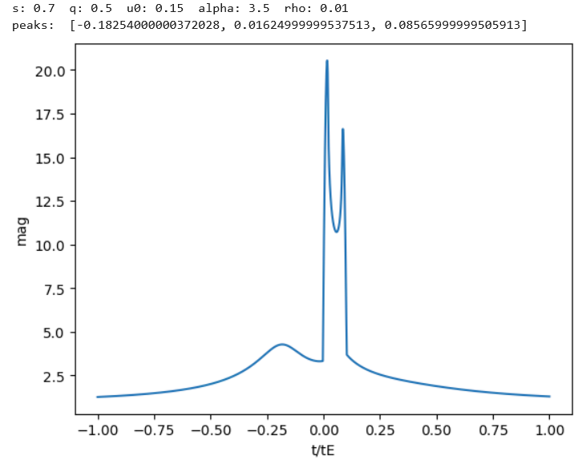

[Back to **Animating fits**](Animation.md)

# Template libraries

As explained before, the module [InitCond](InitCond.md) sets the initial conditions for binary-lens fits by matching the peaks found in the observed datasets to the peaks of the templates in a library, following an original idea by [Mao & Di Stefano (1995)](https://ui.adsabs.harvard.edu/abs/1995ApJ...440...22M/abstract). This matching provides the values for $t_0$ and $t_E$, while all remaining parameters are read from the template.

## Default template library

The default library used by `InitCond` is available [here](/RTModel/data/TemplateLibrary.txt). It is the product of many years of modeling of many different microlensing events. It is based on the idea that a seed is needed in each region of the parameter space where the sequence of peaks in the light curve remains the same (see [Liebig et al. (2015)](https://ui.adsabs.harvard.edu/abs/2015MNRAS.450.1565L/abstract)).

The first line in the library indicates the number of templates, while the following lines contain the information for each template one by one. Each line contains the parameters $s$ $q$ $u_0$ $\alpha$ $\rho$ followed by the time of two peaks $t_1$ $t_2$. If the template has more than two peaks, the template is repeated in the following line with different choices of the times of the peaks. The order of the two peaks does not matter, since `InitCond` always include each template and then its time-reversal. Here is an excerpt from our [template library](/RTModel/data/TemplateLibrary.txt):

```
113
0.7 0.5 0.15 3.5 0.01 -0.18254 0.01625
0.7 0.5 0.15 3.5 0.01 -0.18254 0.08566
0.7 0.5 0.15 3.5 0.01 0.01625 0.08566
0.7 0.1 0.0 5.38 0.01 -0.06613 0.02524
0.7 0.1 0.0 5.38 0.01 -0.06613 0.30473
0.7 0.1 0.0 5.38 0.01 0.02524 0.30473
0.7 0.5 0.0 2.0 0.01 -1.20214 -0.11323
...
```

## Changing the template library

`RTModel` offers the possibility to use a different template library, which can be constructed by hand or using the tools offered by the subpackage `RTModel.templates`. In order to change the template library, you should include the corresponding option in `config_InitCond()`:

```
rtm.config_InitCond(template_library = 'MyLibrary.txt')
```

By providing the full path to your library, `InitCond` will use it to determine the initial seeds for binary-lens fitting. A valid library should conform to the same format of the default library, with the first line containing the number of templates and the following lines with the parameters and peak times as explained above.

## The `RTModel.templates` subpackage

The `RTModel.templates` contains useful tools to visualize the templates of the default library and elaborate your own templates.

### Cloning the default template library

After importing the subpackage, we may start by cloning the default library to a local file

```
import RTModel.templates as tmpl

tmpl.clone_default_library('MyLibrary.txt')
```

### Loading and saving libraries

The content of a template library can be loaded to Python by the function

```
mytemplates = tmpl.load_library('MyLibrary.txt')
```

As a result, `mytemplates` will contain a standard Python list of all templates found in `'MyLibrary.txt'`:

```
print(mytemplates)

[[0.7, 0.5, 0.15, 3.5, 0.01, -0.183, 0.016], [0.7, 0.5, 0.15, 3.5, 0.01, -0.183, 0.086], [0.7, 0.5, 0.15, 3.5, 0.01, 0.016, 0.086], ...
```

At this point, you are free to manipulate the list with standard Python tools. 

When you are happy with your new list of templates, you can save it with the function

```
tmpl.save_library('MyNewLibrary.txt', mytemplates)
```

The new file `'MyNewLibrary.txt'` will be in the format accepted by `RTModel` and ready for use in your modeling runs.

### Visualization and elaboration of the templates

The most useful tool in the `RTModel.templates` subpackage is the `show_template()` function. Here we see an example followed by its output:

```
newtemplates = tmpl.show_template(mytemplates[0], tmin = -1, tmax = +1, tstep = 0.00001, accuracy = 0.001)
```


The  `show_template(mytemplate)` function calculates and shows the lightcurve corresponding to the parameters found in `mytemplate`, which is a standard list containing at least 5 values for $s$ $q$ $u_0$ $\alpha$ $\rho$. The light curves is shown in units of $t/t_E$ with $t_0=0$ from `tmin` to `tmax` (default values are -3 and +3 respectively). The time step for the plot is specified by `tstep` (default value is 0.001) and the accuracy in the magnification calculation is given by `accuracy` (default value is 0.01).

In addition to the visualization, actually  `show_template()` also shows the values of the parameters found and calculates the peak positions in the template that were found between `tmin` and `tmax`. The peaks found are also reported in the output. It is important to underline that the time accuracy for these peaks depends on the time steps specified through `tstep`. Also the `accuracy` option is important to locate the peak more precisely on relatively flat maxima.

The return value of the `show_template()` function is a list of templates built by combining the parameters found in `mytemplate` and all peaks found in the calculation. So the length of `newtemplates` for a light curve with $n$ peaks will be $n(n-1)/2$. The output templates of `show_template()` can then be easily included in a new library of templates.
